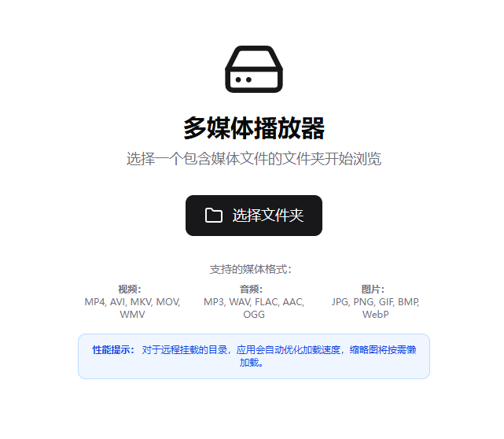

# TMedia - 现代化本地媒体浏览器

一个基于 Next.js 构建的现代化本地媒体文件浏览和播放器，支持图片、视频、音频文件的快速浏览和播放。



## ✨ 核心特性

### 🎯 **智能媒体浏览**

- **文件系统集成**：基于 File System Access API，直接访问本地文件系统
- **卡片视图**：美观的卡片布局，支持缩略图预览
- **扁平化模式**：递归展示所有子目录中的媒体文件
- **实时搜索**：快速搜索文件名和路径

### 🚀 **高性能图片浏览**

- **本地化缓存**：使用 IndexedDB 实现真正的本地持久化缓存
- **智能预加载**：预加载前后 2 张图片，实现瞬时切换
- **缓存状态指示**：可视化显示图片缓存状态
- **双层缓存**：内存缓存 + 本地存储，最佳性能与持久性平衡
- **快速导航**：支持键盘和鼠标快速切换

### 🎬 **专业媒体播放**

- **多格式支持**：支持常见的图片、视频、音频格式
- **全屏播放**：Web 全屏模式，优化的显示比例
- **视频控制**：进度条、音量调节、播放控制
- **键盘快捷键**：专业级快捷键支持

### 🎨 **现代化界面**

- **响应式设计**：适配各种屏幕尺寸
- **暗色主题**：护眼的暗色模式
- **流畅动画**：300ms 过渡动画，提升用户体验
- **毛玻璃效果**：现代化的视觉效果

## 🛠️ 技术栈

- **前端框架**：Next.js 15.4.6 + React 18
- **样式系统**：Tailwind CSS + shadcn/ui
- **类型支持**：TypeScript
- **图标库**：Lucide React
- **API 支持**：File System Access API
- **构建工具**：Turbopack

## 📦 安装使用

### 环境要求

- Node.js 18.0 或更高版本
- 支持 File System Access API 的现代浏览器（Chrome 86+, Edge 86+）

### 快速开始

1. **克隆项目**

```bash
git clone <repository-url>
cd tmedia
```

2. **安装依赖**

```bash
npm install
```

3. **启动开发服务器**

```bash
npm run dev
```

4. **打开浏览器**
   访问 [http://localhost:3000](http://localhost:3000)

### 构建部署

```bash
# 构建生产版本
npm run build

# 启动生产服务器
npm start
```

## 🎮 使用指南

### 基础操作

1. **选择文件夹**：点击"选择文件夹"按钮，选择包含媒体文件的目录
2. **浏览文件**：在卡片视图中浏览媒体文件和文件夹
3. **播放媒体**：点击任意媒体文件开始播放/查看
4. **搜索过滤**：使用顶部搜索框快速找到目标文件

### 扁平化模式

- 点击"扁平化"按钮，递归显示所有子目录中的媒体文件
- 适合浏览分散在多个文件夹中的媒体内容

### 图片浏览

- **导航**：使用左右箭头键或点击导航按钮
- **全屏**：按 F 键或点击全屏按钮
- **缓存状态**：查看底部的缓存指示器了解加载状态

### 视频播放

- **播放控制**：空格键播放/暂停
- **进度控制**：拖动进度条或使用左右箭头键
- **音量调节**：使用上下箭头键或拖动音量滑块
- **全屏播放**：F 键切换全屏模式

## ⌨️ 键盘快捷键

| 功能       | 快捷键 | 说明                         |
| ---------- | ------ | ---------------------------- |
| 播放/暂停  | `空格` | 视频/音频播放控制            |
| 下一个     | `→`    | 图片：下一张，视频：快进 10s |
| 上一个     | `←`    | 图片：上一张，视频：快退 10s |
| 音量增加   | `↑`    | 增加音量 10%                 |
| 音量减少   | `↓`    | 减少音量 10%                 |
| 全屏切换   | `F`    | 进入/退出全屏模式            |
| 关闭播放器 | `Esc`  | 关闭当前媒体播放器           |

## 🏗️ 项目结构

```
tmedia/
├── app/                    # Next.js App Router
│   ├── globals.css        # 全局样式
│   ├── layout.tsx         # 根布局
│   └── page.tsx           # 主页面
├── components/            # React 组件
│   ├── BreadcrumbNav.tsx  # 面包屑导航
│   ├── DirectorySelector.tsx # 目录选择器
│   ├── FileExplorer.tsx   # 文件浏览器
│   ├── MediaPlayer.tsx    # 媒体播放器
│   ├── MediaCard.tsx      # 媒体卡片
│   └── SearchBar.tsx      # 搜索栏
├── lib/                   # 核心库
│   ├── fileSystem.ts      # 文件系统 API
│   ├── imageCache.ts      # 图片缓存服务
│   ├── fullscreen.ts      # 全屏功能
│   ├── keyboard.ts        # 键盘快捷键
│   ├── mediaNavigation.ts # 媒体导航
│   └── types.ts           # 类型定义
└── public/               # 静态资源
```

## 🔧 核心功能模块

### 本地化缓存系统

- **IndexedDB 存储**：文件二进制数据存储在本地 IndexedDB 中
- **持久化缓存**：页面刷新后缓存依然有效，无需重新加载
- **智能预加载**：自动缓存当前图片前后各 2 张
- **双层架构**：内存缓存（快速访问）+ 本地缓存（持久化）
- **容量管理**：最大 50MB 本地存储，最多 20 个文件
- **状态指示**：实时显示缓存状态和存储使用情况

### 全屏播放系统

- **Web 全屏**：基于 CSS 的全屏实现，兼容性更好
- **比例适配**：自动计算最佳显示比例
- **居中显示**：确保媒体内容居中显示
- **状态管理**：完整的进入/退出状态管理

### 媒体导航系统

- **智能过滤**：图片导航时自动跳过视频文件
- **循环导航**：到达列表末尾时的循环处理
- **状态同步**：导航状态与 UI 实时同步

## 🌟 高级特性

### 响应式设计

- **自适应网格**：根据屏幕尺寸自动调整列数
- **移动端优化**：针对触摸设备的交互优化
- **弹性布局**：灵活的 Flexbox/Grid 布局

### 性能优化

- **懒加载**：媒体文件按需加载
- **虚拟化**：大列表的虚拟化渲染
- **缓存策略**：多层级缓存机制
- **内存管理**：自动清理未使用的资源

### 用户体验

- **加载状态**：完整的加载状态指示
- **错误处理**：友好的错误信息和重试机制
- **操作反馈**：即时的视觉反馈
- **无障碍支持**：键盘导航和屏幕阅读器支持

## 🔄 开发指南

### 开发模式

```bash
npm run dev      # 启动开发服务器
npm run build    # 构建生产版本
npm run start    # 启动生产服务器
npm run lint     # 代码检查
```

### 代码规范

- 使用 TypeScript 严格模式
- 遵循 ESLint 和 Prettier 规则
- 组件采用函数式写法
- 使用 React Hooks 管理状态

### 自定义配置

```typescript
// 配置图片缓存
imageCacheService.configure({
  preloadRange: 3, // 预加载范围（前后各3张）
  memoryCacheTimeout: 30 * 60 * 1000, // 内存缓存30分钟过期
  localCacheOptions: {
    maxCacheSize: 100 * 1024 * 1024, // 最大本地缓存 100MB
    maxItems: 30, // 最多缓存30个文件
  },
});

// 或者直接配置本地缓存
localCacheService.configure({
  maxCacheSize: 200 * 1024 * 1024, // 200MB
  maxItems: 50, // 50个文件
});
```

#### 缓存机制说明

- **内存缓存**：临时存储 blob URL，快速访问，页面刷新后丢失
- **本地缓存**：持久化存储文件二进制数据，页面刷新后依然有效
- **自动清理**：超出限制时自动清理最少使用的文件

## 🔐 隐私与安全

### 完全本地化处理

- **零网络传输**：所有文件处理都在浏览器本地进行
- **用户完全控制**：只能访问用户明确选择的文件夹
- **无数据上传**：文件内容从不离开您的设备
- **离线可用**：无需网络连接即可完整使用

### 安全机制

- 基于浏览器原生 File System Access API
- 遵循最小权限原则（仅读取权限）
- 所有操作在浏览器安全沙箱内执行
- 无第三方服务依赖，无隐私泄露风险

## 📝 浏览器兼容性

| 浏览器  | 版本要求 | File System Access API |
| ------- | -------- | ---------------------- |
| Chrome  | 86+      | ✅ 完全支持            |
| Edge    | 86+      | ✅ 完全支持            |
| Firefox | -        | ❌ 暂不支持            |
| Safari  | -        | ❌ 暂不支持            |

> **注意**：此应用依赖 File System Access API，目前仅在基于 Chromium 的浏览器中可用。

## 📄 许可证

MIT License - 查看 [LICENSE](LICENSE) 文件了解详情。

## 🤝 贡献指南

欢迎提交 Issue 和 Pull Request！

1. Fork 本仓库
2. 创建特性分支 (`git checkout -b feature/AmazingFeature`)
3. 提交更改 (`git commit -m 'Add some AmazingFeature'`)
4. 推送到分支 (`git push origin feature/AmazingFeature`)
5. 打开 Pull Request

---

**TMedia** - 让本地媒体文件管理变得简单而高效 🚀
